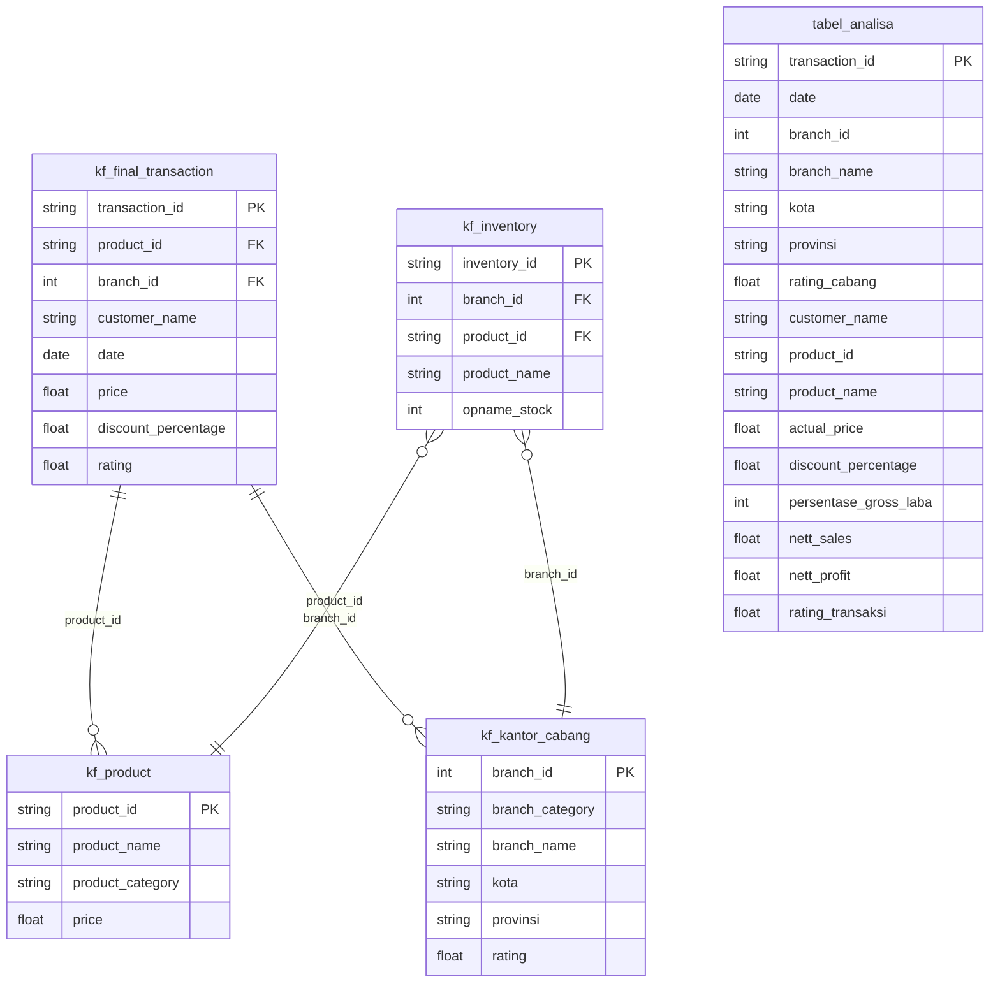

# ERD (Mermaid)

```mermaid
erDiagram
    kf_final_transaction ||--o{ kf_product : "product_id"
    kf_final_transaction ||--o{ kf_kantor_cabang : "branch_id"
    kf_inventory }o--|| kf_product : "product_id"
    kf_inventory }o--|| kf_kantor_cabang : "branch_id"

    kf_final_transaction {
      string transaction_id PK
      string product_id FK
      int branch_id FK
      string customer_name
      date date
      float price
      float discount_percentage
      float rating
    }

    kf_product {
      string product_id PK
      string product_name
      string product_category
      float price
    }

    kf_kantor_cabang {
      int branch_id PK
      string branch_category
      string branch_name
      string kota
      string provinsi
      float rating
    }

    kf_inventory {
      string inventory_id PK
      int branch_id FK
      string product_id FK
      string product_name
      int opname_stock
    }

    tabel_analisa {
      string transaction_id PK
      date date
      int branch_id
      string branch_name
      string kota
      string provinsi
      float rating_cabang
      string customer_name
      string product_id
      string product_name
      float actual_price
      float discount_percentage
      int persentase_gross_laba
      float nett_sales
      float nett_profit
      float rating_transaksi
    }
```
